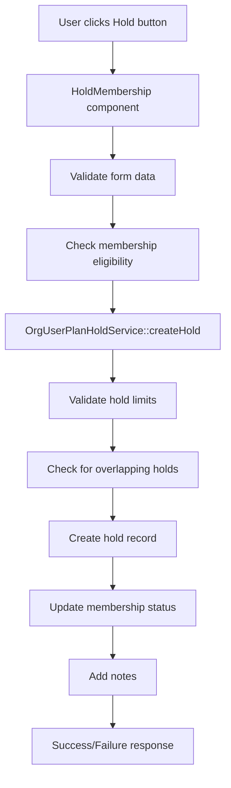
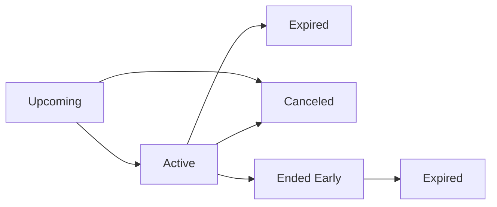

# Hold Membership System Documentation

## Overview
The Hold Membership System allows gym members to temporarily pause their memberships for a specified period. This system includes comprehensive validation, status management, and user interface components.

## System Architecture

### 1. Database Structure

#### Primary Table: `orgUserPlanHold`
```sql
CREATE TABLE orgUserPlanHold (
    id INT PRIMARY KEY AUTO_INCREMENT,
    org_id INT NOT NULL,
    orgUser_id INT NOT NULL,
    byOrgUser_id INT NOT NULL,
    orgUserPlan_id INT NOT NULL,`
    startDateTime DATETIME NOT NULL,
    endDateTime DATETIME NOT NULL,
    note TEXT,
    notifyEmail BOOLEAN DEFAULT FALSE,
    notifyPush BOOLEAN DEFAULT FALSE,
    isCanceled BOOLEAN DEFAULT FALSE,
    status INT NOT NULL,
    created_at INT, -- Unix timestamp
    updated_at INT, -- Unix timestamp
    deleted_at TIMESTAMP NULL
);
```

#### Hold Status Enum Values
```php
enum OrgUserPlanHoldStatus: int
{
    case None = 0;
    case Upcoming = 1;
    case Active = 2;
    case Canceled = 98;
    case Expired = 99;
}
```

### 2. Core Components

#### A. Service Layer
- **`OrgUserPlanHoldService`** - Main business logic service
- **`NotesService`** - For adding hold-related notes
- **`OrgUserPlanService`** - Membership management (fallback)

#### B. Models
- **`OrgUserPlanHold`** - Hold record model
- **`OrgUserPlan`** - Membership model
- **`OrgUser`** - User model

#### C. Livewire Components
- **`HoldMembership`** - Create new holds
- **`HoldDetail`** - View individual hold details
- **`HoldOverview`** - Display hold information card
- **`MembershipHolds`** - List all holds
- **`ModifyHold`** - Edit existing holds
- **`EndHold`** - End holds early
- **`CancelHold`** - Cancel holds

## 3. Hold Management Flow

### Creating a Hold



### Hold Status Lifecycle



## 4. Key Features

### A. Hold Creation (`OrgUserPlanHoldService::createHold`)
```php
public function createHold(OrgUserPlan $orgUserPlan, array $data, ?string $note = null): bool
```

**Validation Rules:**
- Membership must be active and modifiable
- Holds must be enabled for the plan
- Start date must be in the future
- End date must be after start date
- No overlapping holds allowed
- Must not exceed hold count limit
- Must not exceed hold days limit

**Data Structure:**
```php
$data = [
    'startDate' => '2025-09-25',  // Y-m-d format
    'endDate' => '2025-09-30',    // Y-m-d format
    'note' => 'Vacation hold',    // Optional reason
    'notifyEmail' => true,        // Email notification (user selectable)
    'notifyPush' => false         // Push notification (user selectable)
];
```

### B. Hold Modification (`OrgUserPlanHoldService::modifyHold`)
```php
public function modifyHold(OrgUserPlanHold $hold, array $data, ?string $note = null): bool
```

**Rules by Status:**
- **Upcoming Holds**: Can modify both start and end dates
- **Active Holds**: Can only modify end date
- **Canceled/Expired**: Cannot be modified

### C. Hold Cancellation (`OrgUserPlanHoldService::cancelHold`)
```php
public function cancelHold(OrgUserPlanHold $hold, ?string $cancelNote = null): bool
```

**Actions:**
- Sets `isCanceled = true`
- Sets `status = OrgUserPlanHoldStatus::Canceled->value`
- Reactivates membership
- Extends membership end date by hold duration
- Adds cancellation note

### D. Hold Ending (`OrgUserPlanHoldService::endHold`)
```php
public function endHold(OrgUserPlanHold $hold, ?string $note = null): bool
```

**Actions:**
- Sets `status = OrgUserPlanHoldStatus::Expired->value`
- Reactivates membership
- Extends membership end date by actual hold duration
- Adds end note

## 5. User Interface Components

### A. Hold Creation Form
**Location:** `/subscriptions/{id}` (membership view)
**Component:** `HoldMembership`

**Fields:**
- Hold Start Date (date picker)
- Hold End Date (date picker)
- Reason (textarea, optional)
- Auto Resume checkbox
- Send Email Notification (switch)
- Send Push Notification (switch)

### B. Hold Detail Page
**Route:** `/subscriptions/holds/{holdId}`
**Component:** `HoldDetail`

**Sections:**
- Membership Information
- Hold Overview
- Action Buttons (conditional)

### C. Holds List Page
**Route:** `/subscriptions/holds`
**Component:** `MembershipHolds`

**Features:**
- Search by member name/email
- Status filter (All, Active, Upcoming, Expired)
- Sortable columns
- Pagination
- Clickable rows to view details

### D. Hold Overview Card
**Component:** `HoldOverview`
**Usage:** Embedded in membership view and hold detail

**Information Displayed:**
- Hold status with colored badge
- Start and end dates
- Duration in days
- Created by information
- Hold notes

## 6. Permissions System

### Required Permissions
```php
// Basic hold management
'hold memberships'

// Advanced actions
'end hold'
'cancel hold'
'modify hold'
```

### Permission Groups
```php
// Membership Hold management
[
    'hold memberships',
    'end hold',
    'cancel hold',
    'modify hold'
]
```

## 7. Status Management

### Status Determination Logic
```php
private function determineAppropriateStatus(OrgUserPlan $orgUserPlan): int
{
    $today = Carbon::now()->format('Y-m-d');
    
    if ($orgUserPlan->startDateLoc > $today) {
        return OrgUserPlanStatus::Upcoming->value;
    } elseif ($orgUserPlan->endDateLoc && $orgUserPlan->endDateLoc < $today) {
        return OrgUserPlanStatus::Expired->value;
    } else {
        return OrgUserPlanStatus::Active->value;
    }
}
```

### Hold Status Display
```php
public function getHoldStatus($item)
{
    if (isset($item->status)) {
        if ($item->status instanceof \App\Enums\OrgUserPlanHoldStatus) {
            return $item->status->label();
        } else {
            $statusEnum = \App\Enums\OrgUserPlanHoldStatus::from($item->status);
            return $statusEnum->label();
        }
    }
    // Fallback logic for note-based holds
}
```

## 8. Validation Rules

### Hold Creation Validation
```php
protected function rules()
{
    return [
        'holdStartDate' => 'required|date|after:today',
        'holdEndDate' => 'required|date|after:holdStartDate',
        'holdReason' => 'nullable|string|max:500',
        'autoResume' => 'boolean',
        'notifyEmail' => 'boolean',
        'notifyPush' => 'boolean'
    ];
}
```

### Business Logic Validation
- Membership must be active (`status = 2`)
- Membership must allow modifications (`can_be_modified = true`)
- Holds must be enabled (`isHoldEnabled = true`)
- Hold count limit check (`holdCount < holdLimitCount`)
- Hold days limit check (`holdDays + duration <= holdLimitDays`)
- No overlapping holds
- Start date must be future
- End date must be after start date

## 9. Error Handling

### Common Error Messages
```php
// Validation errors
'This membership is already on hold.'
'This membership cannot be modified at this time.'
'Holds are not enabled for this membership.'
'This membership has reached its hold limit.'
'Hold duration exceeds the maximum allowed days.'
'Failed to hold membership. Please check the dates and try again.'

// Action errors
'Hold not found or already processed.'
'Cannot modify expired or canceled holds.'
'Active holds cannot have their start date modified.'
```

### Error Response Pattern
```php
try {
    // Hold operation
    $result = $holdService->createHold($membership, $data, $note);
    
    if ($result) {
        session()->flash('success', 'Hold created successfully');
    } else {
        $this->handleHoldCreationFailure();
    }
} catch (\Exception $e) {
    session()->flash('error', 'Failed to create hold. Please try again.');
}
```

## 10. Routes Configuration

```php
// Membership Holds List
Route::get('subscriptions/holds', \App\Livewire\Subscriptions\MembershipHolds::class)
    ->name('subscriptions.holds');

// Individual Hold Detail
Route::get('subscriptions/holds/{holdId}', \App\Livewire\Subscriptions\HoldDetail::class)
    ->name('subscriptions.holds.detail');

// Individual Membership View
Route::get('subscriptions/{id}', \App\Livewire\Subscriptions\MembershipView::class)
    ->name('subscriptions.view');
```

## 11. Translation Keys

### English Translations (`lang/en/subscriptions.php`)
```php
// Hold actions
'Hold Membership' => 'Hold Membership',
'End Hold' => 'End Hold',
'Cancel Hold' => 'Cancel Hold',
'Modify Hold' => 'Modify Hold',

// Hold information
'Hold Status' => 'Hold Status',
'Hold Duration' => 'Hold Duration',
'Hold Start Date' => 'Hold Start Date',
'Hold End Date' => 'Hold End Date',
'Hold Notes' => 'Hold Notes',

// Notification settings
'Notification Settings' => 'Notification Settings',
'Send Email Notification' => 'Send Email Notification',
'Send Push Notification' => 'Send Push Notification',

// Status labels
'Active' => 'Active',
'Upcoming' => 'Upcoming',
'Expired' => 'Expired',
'Canceled' => 'Canceled',
'None' => 'None',

// Messages
'Hold created successfully' => 'Hold created successfully',
'Hold updated successfully' => 'Hold updated successfully',
'Hold ended successfully' => 'Hold ended successfully',
'Hold canceled successfully' => 'Hold canceled successfully',
```

## 12. Best Practices

### A. Service Usage
```php
// Always use the service for hold operations
$holdService = app(OrgUserPlanHoldService::class);
$result = $holdService->createHold($membership, $data, $note);
```

### B. Status Checking
```php
// Check both status field and isCanceled flag
if ($hold->status == OrgUserPlanHoldStatus::Canceled->value || $hold->isCanceled) {
    return 'Canceled';
}
```

### C. Date Handling
```php
// Always use Carbon for date operations
$duration = round($startDate->diffInDays($endDate));
```

### D. Permission Checks
```php
// Use safe permission checking
optional(auth()->user()->orgUser)?->safeHasPermissionTo('hold memberships')
```

## 13. Testing Scenarios

### A. Hold Creation Tests
- Valid hold creation
- Overlapping holds prevention
- Limit validation (count and days)
- Invalid date ranges
- Membership eligibility checks

### B. Hold Modification Tests
- Upcoming hold full modification
- Active hold end date only modification
- Canceled/expired hold rejection
- Date validation for modifications

### C. Hold Action Tests
- End hold early functionality
- Cancel hold and reactivation
- Status transitions
- Membership date extensions

## 14. Troubleshooting

### Common Issues
1. **Hold not creating**: Check membership eligibility and limits
2. **Status not updating**: Verify enum values and database fields
3. **Buttons not showing**: Check permissions and hold status
4. **Dates not displaying**: Verify Carbon object conversion
5. **Duration showing decimals**: Ensure `round()` is used

### Debug Tools
- Laravel logs for service operations
- Browser console for JavaScript errors
- Database queries for data verification
- Permission checks for access control

## 15. Future Enhancements

### Potential Features
- Bulk hold operations
- Hold templates/presets
- Automated hold notifications
- Hold analytics and reporting
- Integration with payment systems
- Mobile app support

---

This documentation provides a complete overview of the Hold Membership System implementation. For specific implementation details, refer to the individual component files and service classes.
