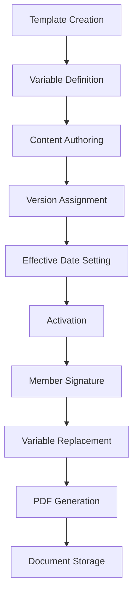

# Template Management & Customization Guide

## Overview

This guide provides comprehensive instructions for managing and customizing terms of service templates in the WodWorx FOH system. It covers template creation, variable usage, version management, and best practices for organization administrators.

## Template System Architecture

### Template Storage Structure

```sql
-- org_terms table structure
CREATE TABLE org_terms (
    id BIGINT UNSIGNED AUTO_INCREMENT PRIMARY KEY,
    org_id BIGINT UNSIGNED NOT NULL,           -- Organization isolation
    title VARCHAR(255) NOT NULL,               -- Template title
    content LONGTEXT NOT NULL,                 -- HTML template content
    version VARCHAR(10) DEFAULT '1.0',         -- Version control
    effective_date DATE NOT NULL,              -- When terms become active
    is_active BOOLEAN DEFAULT TRUE,            -- Enable/disable status
    created_at TIMESTAMP NULL,
    updated_at TIMESTAMP NULL,
    deleted_at TIMESTAMP NULL                  -- Soft delete for history
);
```

### Template Processing Flow



## Template Variables

### Available Variable Types

#### Member Information Variables
```html
<!-- Member identification -->
{{member_name}}        <!-- Full name as entered during registration -->
{{member_email}}       <!-- Email address (displays "Not provided" if empty) -->
{{member_phone}}       <!-- Complete phone number with country code -->
{{member_dob}}         <!-- Date of birth formatted as "January 15, 1990" -->
{{member_gender}}      <!-- "Male", "Female", or "Not specified" -->

<!-- Usage example -->
<p>This agreement is between <strong>{{org_name}}</strong> and <strong>{{member_name}}</strong>.</p>
<p>Member Contact: {{member_email}} | {{member_phone}}</p>
```

#### Organization Variables
```html
<!-- Organization details -->
{{org_name}}           <!-- Organization name from database -->

<!-- Future organization variables (planned) -->
{{org_address}}        <!-- Organization address -->
{{org_phone}}          <!-- Organization phone number -->
{{org_email}}          <!-- Organization email -->
{{org_website}}        <!-- Organization website -->

<!-- Usage example -->
<h1>{{org_name}} - Membership Agreement</h1>
<p>Welcome to {{org_name}}! We're excited to have you as a member.</p>
```

#### System & Date Variables
```html
<!-- Date and version information -->
{{signature_date}}     <!-- Date when member signed (e.g., "January 15, 2024") -->
{{effective_date}}     <!-- Terms effective date -->
{{version}}           <!-- Terms version number -->

<!-- Usage example -->
<p><strong>Agreement Date:</strong> {{signature_date}}</p>
<p><strong>Terms Version:</strong> {{version}} (Effective: {{effective_date}})</p>
```

### Variable Replacement Rules

#### Processing Order
1. **System variables** processed first (dates, versions)
2. **Organization variables** processed second
3. **Member variables** processed last (to prevent conflicts)

#### Formatting Rules
```php
// Date formatting examples
{{signature_date}}     // Output: "January 15, 2024"
{{effective_date}}     // Output: "December 1, 2023"

// Text formatting examples  
{{member_name}}        // Output: "John Smith"
{{member_email}}       // Output: "john@example.com" or "Not provided"
{{member_phone}}       // Output: "+1555-123-4567"

// Gender formatting
{{member_gender}}      // Output: "Male", "Female", or "Not specified"
```

#### Error Handling
```html
<!-- Safe variable usage with fallbacks -->
<p>Email: {{member_email}}</p>  <!-- Shows "Not provided" if empty -->
<p>Date of Birth: {{member_dob}}</p>  <!-- Shows "Not provided" if empty -->

<!-- Variables that always have values -->
<p>Name: {{member_name}}</p>      <!-- Required field, always present -->
<p>Phone: {{member_phone}}</p>    <!-- Required field, always present -->
```

## Template Content Guidelines

### HTML Structure Best Practices

#### Document Structure
```html
<!DOCTYPE html>
<html>
<head>
    <title>{{org_name}} - Membership Agreement</title>
    <style>
        body { font-family: Arial, sans-serif; line-height: 1.6; margin: 40px; }
        h1 { color: #333; border-bottom: 2px solid #333; }
        h2 { color: #666; margin-top: 30px; }
        .signature-section { margin-top: 50px; border-top: 1px solid #ccc; padding-top: 20px; }
        .member-info { background: #f9f9f9; padding: 15px; margin: 20px 0; }
    </style>
</head>
<body>
    <h1>{{org_name}} - Membership Agreement</h1>
    
    <!-- Member Information Section -->
    <div class="member-info">
        <h2>Member Information</h2>
        <p><strong>Name:</strong> {{member_name}}</p>
        <p><strong>Email:</strong> {{member_email}}</p>
        <p><strong>Phone:</strong> {{member_phone}}</p>
        <p><strong>Date of Birth:</strong> {{member_dob}}</p>
        <p><strong>Gender:</strong> {{member_gender}}</p>
    </div>
    
    <!-- Terms Content -->
    <h2>1. Membership Terms</h2>
    <p>Your membership content here...</p>
    
    <!-- Signature Section -->
    <div class="signature-section">
        <h2>Electronic Signature</h2>
        <p><strong>Signed on:</strong> {{signature_date}}</p>
        <p><strong>Agreement Version:</strong> {{version}}</p>
        <div style="margin-top: 30px;">
            <p>Member Signature:</p>
            <!-- Signature will be automatically inserted here -->
        </div>
    </div>
</body>
</html>
```

#### Content Sections Template

```html
<!-- 1. Header and Member Information -->
<div class="header-section">
    <h1>{{org_name}} - Membership Agreement</h1>
    <p><strong>Effective Date:</strong> {{effective_date}}</p>
    <p><strong>Version:</strong> {{version}}</p>
</div>

<div class="member-identification">
    <h2>Member Information</h2>
    <table style="width: 100%; border-collapse: collapse;">
        <tr>
            <td style="padding: 8px; border: 1px solid #ddd;"><strong>Full Name:</strong></td>
            <td style="padding: 8px; border: 1px solid #ddd;">{{member_name}}</td>
        </tr>
        <tr>
            <td style="padding: 8px; border: 1px solid #ddd;"><strong>Email:</strong></td>
            <td style="padding: 8px; border: 1px solid #ddd;">{{member_email}}</td>
        </tr>
        <tr>
            <td style="padding: 8px; border: 1px solid #ddd;"><strong>Phone:</strong></td>
            <td style="padding: 8px; border: 1px solid #ddd;">{{member_phone}}</td>
        </tr>
        <tr>
            <td style="padding: 8px; border: 1px solid #ddd;"><strong>Date of Birth:</strong></td>
            <td style="padding: 8px; border: 1px solid #ddd;">{{member_dob}}</td>
        </tr>
    </table>
</div>

<!-- 2. Membership Terms -->
<div class="membership-terms">
    <h2>1. Membership Terms and Conditions</h2>
    <p>By signing this agreement, {{member_name}} agrees to become a member of {{org_name}} subject to the following terms and conditions:</p>
    
    <h3>1.1 Membership Duration</h3>
    <p>This membership agreement begins on {{signature_date}} and continues on a month-to-month basis unless terminated in accordance with the cancellation policy outlined below.</p>
    
    <h3>1.2 Membership Fees</h3>
    <p>Member agrees to pay the monthly membership fee as established by {{org_name}} and communicated at the time of enrollment. Fees are due on the same day each month as the initial enrollment date.</p>
</div>

<!-- 3. Payment Terms -->
<div class="payment-terms">
    <h2>2. Payment Authorization</h2>
    <p>{{member_name}} authorizes {{org_name}} to charge the payment method provided for:</p>
    <ul>
        <li>Monthly membership dues</li>
        <li>Any applicable enrollment or initiation fees</li>
        <li>Additional services or products purchased</li>
        <li>Any applicable taxes</li>
    </ul>
</div>

<!-- 4. Liability Waiver -->
<div class="liability-waiver">
    <h2>3. Assumption of Risk and Release of Claims</h2>
    <p><strong>IMPORTANT:</strong> This section contains a release of liability. Please read carefully.</p>
    
    <p>{{member_name}} understands that participation in fitness activities at {{org_name}} involves inherent risks including, but not limited to:</p>
    <ul>
        <li>Risk of injury from exercise equipment</li>
        <li>Risk of injury from physical exertion</li>
        <li>Risk of injury from interaction with other members</li>
        <li>Risk of aggravation of pre-existing conditions</li>
    </ul>
    
    <p>{{member_name}} voluntarily assumes all risks associated with membership and use of {{org_name}} facilities.</p>
</div>

<!-- 5. Facility Rules -->
<div class="facility-rules">
    <h2>4. Facility Rules and Conduct</h2>
    <p>{{member_name}} agrees to abide by all {{org_name}} facility rules and policies, including:</p>
    <ul>
        <li>Proper use of equipment and facilities</li>
        <li>Respectful behavior toward staff and other members</li>
        <li>Compliance with safety guidelines and procedures</li>
        <li>Adherence to dress code and hygiene standards</li>
    </ul>
</div>

<!-- 6. Cancellation Policy -->
<div class="cancellation-policy">
    <h2>5. Cancellation and Termination</h2>
    <p>{{member_name}} may cancel this membership by providing written notice to {{org_name}}. Cancellation policies are as follows:</p>
    <ul>
        <li>30-day written notice required for cancellation</li>
        <li>No refunds for partial months</li>
        <li>Annual memberships subject to specific cancellation terms</li>
        <li>{{org_name}} reserves the right to terminate membership for violation of facility rules</li>
    </ul>
</div>

<!-- 7. Medical Disclaimer -->
<div class="medical-disclaimer">
    <h2>6. Medical and Health Acknowledgment</h2>
    <p>{{member_name}} represents and warrants that:</p>
    <ul>
        <li>I am in good physical condition and have no medical restrictions that would prevent safe participation</li>
        <li>I will immediately notify {{org_name}} of any changes in my health status</li>
        <li>I understand that {{org_name}} does not provide medical advice</li>
        <li>I have been advised to consult with a physician before beginning any exercise program</li>
    </ul>
</div>

<!-- 8. Electronic Signature Consent -->
<div class="electronic-consent">
    <h2>7. Electronic Signature Consent</h2>
    <p>{{member_name}} consents to the use of electronic signatures and electronic records for this transaction. I understand that:</p>
    <ul>
        <li>My electronic signature has the same legal effect as a handwritten signature</li>
        <li>I have the right to receive a paper copy of this agreement upon request</li>
        <li>Electronic records will be stored securely and made available for review</li>
        <li>I may withdraw consent to electronic signatures, though it will not affect this agreement's validity</li>
    </ul>
</div>

<!-- 9. Agreement Acknowledgment -->
<div class="acknowledgment">
    <h2>8. Acknowledgment and Agreement</h2>
    <p>By signing below, {{member_name}} acknowledges that:</p>
    <ul>
        <li>I have read and understand all terms and conditions of this agreement</li>
        <li>I am entering into this agreement voluntarily</li>
        <li>I understand this is a legally binding contract</li>
        <li>I am giving up substantial legal rights, including my right to sue</li>
        <li>I have had the opportunity to ask questions about this agreement</li>
    </ul>
</div>

<!-- 10. Signature Section -->
<div class="signature-section">
    <h2>Electronic Signature</h2>
    <table style="width: 100%; margin-top: 30px;">
        <tr>
            <td style="width: 50%; vertical-align: top;">
                <p><strong>Member Name:</strong> {{member_name}}</p>
                <p><strong>Signature Date:</strong> {{signature_date}}</p>
                <p><strong>Agreement Version:</strong> {{version}}</p>
            </td>
            <td style="width: 50%; text-align: center; vertical-align: top;">
                <p><strong>Digital Signature:</strong></p>
                <div style="border: 1px solid #ccc; height: 100px; margin: 10px 0; display: flex; align-items: center; justify-content: center; background-color: #f9f9f9;">
                    <em>[Digital signature will be inserted here]</em>
                </div>
            </td>
        </tr>
    </table>
    
    <p style="margin-top: 20px; font-style: italic; text-align: center;">
        This document has been electronically signed and is legally binding.
    </p>
</div>
```

### CSS Styling Guidelines

#### Print-Friendly Styles
```css
<style>
/* Base styles for PDF generation */
body {
    font-family: 'Helvetica', 'Arial', sans-serif;
    font-size: 12px;
    line-height: 1.4;
    color: #333;
    margin: 0;
    padding: 20px;
}

/* Headings */
h1 {
    font-size: 18px;
    font-weight: bold;
    color: #000;
    border-bottom: 2px solid #333;
    padding-bottom: 10px;
    margin-bottom: 20px;
}

h2 {
    font-size: 14px;
    font-weight: bold;
    color: #333;
    margin-top: 25px;
    margin-bottom: 10px;
}

h3 {
    font-size: 12px;
    font-weight: bold;
    color: #333;
    margin-top: 15px;
    margin-bottom: 8px;
}

/* Content sections */
.member-info {
    background-color: #f8f9fa;
    border: 1px solid #dee2e6;
    padding: 15px;
    margin: 20px 0;
    border-radius: 4px;
}

.signature-section {
    margin-top: 40px;
    padding-top: 20px;
    border-top: 2px solid #333;
}

/* Tables */
table {
    width: 100%;
    border-collapse: collapse;
    margin: 10px 0;
}

td, th {
    padding: 8px 12px;
    border: 1px solid #ddd;
    text-align: left;
}

th {
    background-color: #f8f9fa;
    font-weight: bold;
}

/* Lists */
ul {
    margin: 10px 0;
    padding-left: 20px;
}

li {
    margin-bottom: 5px;
}

/* Emphasis */
strong {
    font-weight: bold;
}

em {
    font-style: italic;
}

/* Page breaks (for multi-page documents) */
.page-break {
    page-break-before: always;
}

/* Signature placeholder */
.signature-placeholder {
    border: 1px solid #ccc;
    height: 80px;
    margin: 15px 0;
    background-color: #f9f9f9;
    display: flex;
    align-items: center;
    justify-content: center;
    font-style: italic;
    color: #666;
}
</style>
```

## Version Management

### Version Control Strategy

#### Version Number Format
```
Format: MAJOR.MINOR
Examples: 1.0, 1.1, 2.0, 2.1

MAJOR version changes:
- Significant legal modifications
- New liability sections
- Changed payment terms
- Modified cancellation policies

MINOR version changes:
- Typo corrections
- Clarification of existing terms
- Formatting improvements
- Additional contact information
```

#### Effective Date Management
```php
// Version activation examples

// Immediate activation
$terms = new OrgTerms([
    'effective_date' => now()->toDateString(),  // Active immediately
    'version' => '1.1'
]);

// Scheduled activation
$terms = new OrgTerms([
    'effective_date' => '2024-02-01',  // Active starting February 1st
    'version' => '2.0'
]);

// Future planning
$terms = new OrgTerms([
    'effective_date' => '2024-06-01',  // Scheduled for future activation
    'version' => '2.1'
]);
```

#### Version History Preservation
```php
// Historical version access
$currentTerms = OrgTerms::getLatestForOrg($orgId);           // Current active version
$allVersions = OrgTerms::where('org_id', $orgId)->get();    // Complete history
$version1 = OrgTerms::where('org_id', $orgId)              // Specific version
    ->where('version', '1.0')->first();

// Soft delete preservation
$deletedTerms = OrgTerms::withTrashed()                     // Include deleted versions
    ->where('org_id', $orgId)->get();
```

## Template Creation Process

### Step-by-Step Creation Guide

#### 1. Planning Phase
```checklist
□ Identify target organization
□ Review current terms (if any)
□ Determine version number
□ Set effective date
□ Identify required legal sections
□ Plan variable usage
□ Consider multi-page layout
```

#### 2. Content Development
```checklist
□ Write header section with organization info
□ Create member information section
□ Develop membership terms content
□ Add payment and billing terms
□ Include liability waiver language
□ Write facility rules section
□ Add cancellation policy
□ Include medical disclaimers
□ Add electronic signature consent
□ Create signature section
```

#### 3. Variable Integration
```checklist
□ Replace organization name with {{org_name}}
□ Replace member references with {{member_name}}
□ Add contact variables {{member_email}}, {{member_phone}}
□ Include date variables {{signature_date}}, {{effective_date}}
□ Add version reference {{version}}
□ Test variable placement and formatting
```

#### 4. Quality Assurance
```checklist
□ Validate HTML structure
□ Test CSS styling for PDF output
□ Verify all variables are correctly placed
□ Check legal content completeness
□ Review formatting and readability
□ Test with sample member data
```

### Template Testing

#### Development Testing
```php
// Generate preview PDF for testing
$orgUser = OrgUser::factory()->make([
    'fullName' => 'John Doe',
    'email' => 'john@example.com',
    'phoneCountry' => '+1',
    'phoneNumber' => '555-123-4567',
    'dob' => '1990-01-15',
    'gender' => 1,
    'org_id' => $orgId
]);

$pdfService = new TermsPdfService();
$previewFilename = $pdfService->generatePreviewPdf($orgUser);

// Review generated PDF for:
// - Variable replacement accuracy
// - Formatting and layout
// - Legal content completeness
// - Professional appearance
```

#### User Acceptance Testing
```checklist
□ Legal team review of content
□ Organization admin approval
□ Sample PDF generation test
□ Mobile signature device testing
□ Complete member flow testing
□ Document storage verification
```

## Template Customization Examples

### Basic Membership Template
```html
<h1>{{org_name}} - Basic Membership Agreement</h1>

<div class="member-info">
    <h2>Member Information</h2>
    <p><strong>Name:</strong> {{member_name}}</p>
    <p><strong>Email:</strong> {{member_email}}</p>
    <p><strong>Phone:</strong> {{member_phone}}</p>
    <p><strong>Agreement Date:</strong> {{signature_date}}</p>
</div>

<h2>Membership Terms</h2>
<p>Welcome to {{org_name}}! This agreement outlines the terms of your membership.</p>

<h3>Monthly Membership</h3>
<p>Your membership includes unlimited access to {{org_name}} facilities during operating hours.</p>

<h3>Payment Terms</h3>
<p>Monthly dues are automatically charged on the same date each month as your enrollment.</p>

<div class="signature-section">
    <h2>Agreement</h2>
    <p>By signing below, {{member_name}} agrees to all terms and conditions.</p>
    <p><strong>Signed on:</strong> {{signature_date}}</p>
</div>
```

### Premium Membership Template
```html
<h1>{{org_name}} - Premium Membership Agreement</h1>

<div class="member-info">
    <h2>Member Information</h2>
    <table>
        <tr><td><strong>Name:</strong></td><td>{{member_name}}</td></tr>
        <tr><td><strong>Email:</strong></td><td>{{member_email}}</td></tr>
        <tr><td><strong>Phone:</strong></td><td>{{member_phone}}</td></tr>
        <tr><td><strong>Date of Birth:</strong></td><td>{{member_dob}}</td></tr>
        <tr><td><strong>Gender:</strong></td><td>{{member_gender}}</td></tr>
    </table>
</div>

<h2>Premium Membership Benefits</h2>
<p>{{member_name}} is enrolling in our Premium Membership which includes:</p>
<ul>
    <li>Unlimited facility access</li>
    <li>Personal training sessions</li>
    <li>Group class participation</li>
    <li>Guest privileges</li>
    <li>Premium locker rental</li>
</ul>

<h2>Investment and Payment</h2>
<p>Premium membership investment includes monthly dues plus applicable taxes.</p>

<h2>Liability Waiver</h2>
<p><strong>IMPORTANT:</strong> {{member_name}} acknowledges that fitness activities involve inherent risks and voluntarily assumes all risks associated with membership at {{org_name}}.</p>

<div class="signature-section">
    <h2>Electronic Signature</h2>
    <p>{{member_name}} electronically signs this agreement on {{signature_date}}.</p>
    <p>Agreement Version: {{version}} | Effective: {{effective_date}}</p>
</div>
```

### Corporate Membership Template
```html
<h1>{{org_name}} - Corporate Membership Agreement</h1>

<div class="member-info">
    <h2>Employee Information</h2>
    <p><strong>Employee Name:</strong> {{member_name}}</p>
    <p><strong>Email:</strong> {{member_email}}</p>
    <p><strong>Phone:</strong> {{member_phone}}</p>
    <p><strong>Company:</strong> [Company Name]</p>
    <p><strong>Employee ID:</strong> [Employee ID]</p>
</div>

<h2>Corporate Membership Terms</h2>
<p>This agreement covers {{member_name}}'s participation in the corporate wellness program at {{org_name}}.</p>

<h3>Corporate Benefits</h3>
<ul>
    <li>Discounted membership rates</li>
    <li>Flexible scheduling options</li>
    <li>Corporate wellness programs</li>
    <li>Team building activities</li>
</ul>

<h3>Employment Verification</h3>
<p>This membership is contingent on continued employment with the sponsoring company.</p>

<div class="signature-section">
    <h2>Employee Agreement</h2>
    <p>{{member_name}} agrees to the corporate membership terms and acknowledges receipt of the employee handbook.</p>
    <p><strong>Signature Date:</strong> {{signature_date}}</p>
</div>
```

## Troubleshooting Common Issues

### Variable Replacement Problems

#### Issue: Variables Not Replacing
```html
<!-- Problem: Incorrect variable syntax -->
{member_name}          <!-- Missing double braces -->
{{ member_name }}      <!-- Extra spaces inside braces -->
{{member_name          <!-- Missing closing braces -->

<!-- Solution: Correct syntax -->
{{member_name}}        <!-- Correct format -->
{{member_email}}       <!-- No spaces inside braces -->
{{org_name}}           <!-- Consistent formatting -->
```

#### Issue: Empty Variable Values
```html
<!-- Problem: Variables showing as empty -->
<p>Email: {{member_email}}</p>  <!-- Shows blank if no email -->

<!-- Solution: Handle empty values gracefully -->
<p>Email: {{member_email}}</p>  <!-- System shows "Not provided" for empty emails -->

<!-- Or use conditional content -->
<p>Member: {{member_name}} ({{member_email}})</p>  <!-- Email shows "Not provided" if empty -->
```

### PDF Generation Issues

#### Issue: Poor PDF Formatting
```css
/* Problem: CSS not PDF-friendly */
.fancy-gradient {
    background: linear-gradient(45deg, #ff0000, #0000ff);  /* Not supported */
}

/* Solution: Simple, PDF-compatible styles */
.header {
    background-color: #f8f9fa;  /* Solid colors work better */
    border: 1px solid #333;
    padding: 10px;
}
```

#### Issue: Long Content Overflow
```html
<!-- Problem: Content doesn't fit on page -->
<div style="height: 2000px;">Very long content...</div>

<!-- Solution: Use page breaks -->
<div class="section">Content for page 1...</div>
<div class="page-break"></div>  <!-- Force new page -->
<div class="section">Content for page 2...</div>
```

### Template Validation

#### Content Validation Checklist
```checklist
□ All required legal sections included
□ Variable syntax is correct ({{variable}})
□ HTML structure is valid
□ CSS is PDF-compatible
□ No JavaScript (not supported in PDF)
□ Tables are properly formatted
□ Images have proper paths (if any)
□ Content fits within page margins
□ Signature section is clearly defined
□ Version and date information included
```

## Best Practices Summary

### Content Best Practices
- ✅ **Clear Language**: Use simple, understandable terms
- ✅ **Complete Information**: Include all required legal elements
- ✅ **Consistent Formatting**: Maintain professional appearance
- ✅ **Variable Usage**: Properly implement all available variables
- ✅ **Legal Review**: Have templates reviewed by qualified attorneys

### Technical Best Practices
- ✅ **Valid HTML**: Ensure proper HTML structure
- ✅ **PDF-Compatible CSS**: Use simple, supported styles
- ✅ **Version Control**: Implement proper version numbering
- ✅ **Testing**: Thoroughly test before activation
- ✅ **Backup**: Maintain copies of all template versions

### Maintenance Best Practices
- ✅ **Regular Review**: Update templates annually or as needed
- ✅ **Legal Compliance**: Stay current with legal requirements
- ✅ **User Feedback**: Incorporate feedback from staff and members
- ✅ **Performance Monitoring**: Monitor PDF generation performance
- ✅ **Documentation**: Keep detailed records of all changes

This comprehensive guide provides everything needed to successfully manage and customize terms of service templates in the WodWorx FOH system.