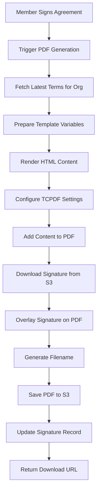

# Terms of Service System - Design Analysis & Implementation

## Overview

This document analyzes the design decisions, alternatives considered, and implementation rationale for the Terms of Service system in the WodWorx FOH project. The system provides organization-specific, template-based terms with digital signature integration and automated PDF generation.

## Business Requirements

### Primary Objectives
1. **Legal Compliance**: Ensure legally binding member agreements
2. **Organization Autonomy**: Allow each gym to have customized terms
3. **Staff Efficiency**: Seamless integration with member onboarding flow
4. **Document Management**: Professional PDF generation and storage
5. **Audit Trail**: Complete signature and agreement history

### Key Stakeholders
- **Gym Staff**: Need simple, fast member onboarding
- **Gym Owners**: Require customizable terms and legal protection
- **Members**: Need clear, accessible agreement process
- **Legal Teams**: Require compliant digital signature process
- **System Administrators**: Need manageable template system

## Design Decision Analysis

### 1. Template-Based vs. Static Terms

#### Options Considered:

**A) Static Terms (Rejected)**
```
Pros:
- Simple implementation
- No database complexity
- Fast rendering

Cons:
- No customization per organization
- Hard-coded content difficult to update
- No version control
- Poor scalability for multi-tenant system
```

**B) Configuration-Based Terms (Rejected)**
```
Pros:
- Some customization possible
- Stored in config files
- Version control through Git

Cons:
- Requires code deployment for changes
- No GUI for non-technical users
- Limited dynamic content
- No per-organization versioning
```

**C) Template-Based System (✅ Selected)**
```
Pros:
- Full organization customization
- Dynamic variable replacement
- Database-driven (no deployments needed)
- Version control and history
- Scalable for multi-tenant architecture
- Admin interface potential

Cons:
- More complex implementation
- Database storage requirements
- Template syntax learning curve
```

**Decision Rationale**: Template-based system chosen for maximum flexibility, multi-tenant compatibility, and future scalability.

### 2. Storage Architecture

#### Database Schema Design

**Chosen Approach**: Dedicated `org_terms` table
```sql
CREATE TABLE org_terms (
    id BIGINT UNSIGNED AUTO_INCREMENT PRIMARY KEY,
    org_id BIGINT UNSIGNED NOT NULL,           -- Multi-tenant isolation
    title VARCHAR(255) NOT NULL,               -- Human-readable title
    content LONGTEXT NOT NULL,                 -- HTML template content
    version VARCHAR(10) DEFAULT '1.0',         -- Version control
    effective_date DATE NOT NULL,              -- Legal effective date
    is_active BOOLEAN DEFAULT TRUE,            -- Enable/disable terms
    created_at TIMESTAMP NULL,
    updated_at TIMESTAMP NULL,
    deleted_at TIMESTAMP NULL,                 -- Soft deletes for history
    
    FOREIGN KEY (org_id) REFERENCES org(id),
    INDEX idx_org_active (org_id, is_active),  -- Performance optimization
    INDEX idx_org_version (org_id, version)    -- Version lookup optimization
);
```

**Alternative Approaches Rejected**:

1. **JSON Column Approach**: Store terms as JSON in org table
   - ❌ No proper indexing, difficult queries, limited search capability

2. **File-Based Storage**: Store templates as files
   - ❌ No database relationships, difficult backup/restore, no atomic updates

3. **External CMS Integration**: Use headless CMS
   - ❌ Additional complexity, external dependencies, cost implications

**Design Benefits**:
- ✅ **Multi-tenant isolation** through org_id
- ✅ **Version control** with effective dates
- ✅ **Soft deletes** for audit trail
- ✅ **Performance indexes** for fast queries
- ✅ **Relational integrity** with foreign keys

### 3. Template Variable System

#### Variable Replacement Strategy

**Chosen Approach**: Simple string replacement with `{{variable}}` syntax

```php
// Template content example
$content = "Welcome to {{org_name}}, {{member_name}}!";

// Variable replacement
$variables = [
    '{{org_name}}' => 'CrossFit Downtown',
    '{{member_name}}' => 'John Doe'
];

foreach ($variables as $placeholder => $value) {
    $content = str_replace($placeholder, $value, $content);
}
```

**Alternative Approaches Considered**:

1. **Blade Template Engine**
   - ❌ Security concerns with user-generated templates
   - ❌ Complex syntax for non-technical users
   - ❌ Potential for code injection

2. **Twig Template Engine**
   - ❌ Additional dependency
   - ❌ Learning curve for template creators
   - ❌ Overkill for simple variable replacement

3. **Custom Parser with Regex**
   - ❌ Complex implementation
   - ❌ Error-prone for edge cases
   - ❌ Difficult to maintain

**Selected Benefits**:
- ✅ **Simple syntax** easy for non-technical users
- ✅ **No security risks** from template execution
- ✅ **Fast performance** with simple string operations
- ✅ **Predictable behavior** with explicit variable mapping

#### Supported Variables

**Member Data Variables**:
```php
'{{member_name}}'    => $orgUser->fullName
'{{member_email}}'   => $orgUser->email ?? 'Not provided'
'{{member_phone}}'   => $orgUser->phoneCountry . $orgUser->phoneNumber
'{{member_dob}}'     => formatted date of birth
'{{member_gender}}'  => 'Male', 'Female', or 'Not specified'
```

**Organization Variables**:
```php
'{{org_name}}'       => $organization->name
'{{org_address}}'    => $organization->address (future)
'{{org_phone}}'      => $organization->phone (future)
'{{org_email}}'      => $organization->email (future)
```

**System Variables**:
```php
'{{signature_date}}'  => date when signed
'{{effective_date}}'  => terms effective date
'{{version}}'         => terms version number
'{{current_date}}'    => today's date (future)
```

### 4. PDF Generation Architecture

#### Technology Selection: TCPDF

**Chosen**: TCPDF Library
```php
// Implementation approach
use TCPDF;

class TermsPdfService 
{
    protected $tcpdf;
    
    public function generateSignedTermsPdf(OrgUser $orgUser, Signature $signature): string
    {
        // Configure PDF with organization branding
        // Render HTML template to PDF
        // Overlay digital signature image
        // Save to S3 storage
    }
}
```

**Alternatives Considered**:

1. **DomPDF**
   - ❌ Limited HTML/CSS support
   - ❌ Poor image handling
   - ❌ No digital signature overlay capability

2. **wkhtmltopdf**
   - ❌ External binary dependency
   - ❌ Server installation complexity
   - ❌ Limited customization for signatures

3. **Puppeteer/Chrome Headless**
   - ❌ Node.js dependency
   - ❌ High resource usage
   - ❌ Complex signature overlay process

**TCPDF Selection Benefits**:
- ✅ **Pure PHP** implementation
- ✅ **Excellent image support** for signature overlay
- ✅ **Professional PDF features** (headers, footers, metadata)
- ✅ **Fine-grained control** over positioning and formatting
- ✅ **Proven reliability** in production environments

#### PDF Generation Workflow



### 5. Version Control Strategy

#### Versioning Approach

**Selected Strategy**: Date + Version Number System

```php
// Version control logic
public static function getLatestForOrg($orgId)
{
    return static::where('org_id', $orgId)
        ->active()
        ->orderBy('effective_date', 'desc')  // Latest effective date first
        ->orderBy('version', 'desc')         // Highest version number first
        ->first();
}
```

**Version Number Format**: Semantic versioning (1.0, 1.1, 2.0)
- **Major versions** (1.0 → 2.0): Significant legal changes
- **Minor versions** (1.0 → 1.1): Small updates, clarifications

**Effective Date Strategy**:
- **Future dates**: Terms scheduled for activation
- **Current date**: Immediately active terms
- **Past dates**: Historical terms for audit

**Benefits**:
- ✅ **Legal compliance** with dated agreements
- ✅ **Gradual rollout** capability
- ✅ **Audit trail** preservation
- ✅ **Rollback capability** if needed

### 6. Multi-Tenancy Integration

#### Tenant Isolation Strategy

**Implementation**: Organization-based tenancy with global scopes

```php
// Automatic tenant filtering
class OrgTerms extends Model
{
    use Tenantable;  // Applies TenantScope globally
    
    // All queries automatically filtered by current user's org_id
}

// Manual tenant-specific queries
$terms = OrgTerms::where('org_id', $currentOrgId)->active()->first();
```

**Security Considerations**:
- ✅ **Automatic filtering** prevents cross-tenant data access
- ✅ **Explicit org_id checks** in critical operations
- ✅ **Foreign key constraints** ensure data integrity
- ✅ **Audit logging** for all terms modifications

## Implementation Challenges & Solutions

### Challenge 1: Template Security

**Problem**: User-generated templates could contain malicious content
**Solution**: 
- Simple string replacement (no code execution)
- HTML sanitization before PDF generation
- Whitelist of allowed variables only

### Challenge 2: PDF Performance

**Problem**: Large terms documents could cause memory issues
**Solution**:
- TCPDF memory optimization settings
- Lazy PDF generation (only when needed)
- S3 storage to avoid repeated generation

### Challenge 3: Signature Overlay Positioning

**Problem**: Signatures need consistent positioning across different terms
**Solution**:
- Standardized signature placeholder in templates
- Automatic signature detection and overlay
- Configurable signature positioning

### Challenge 4: Version Migration

**Problem**: Existing members signed old versions of terms
**Solution**:
- Soft deletes preserve historical terms
- Signature records link to specific term versions
- Audit trail maintains legal validity

## Testing Strategy

### Unit Testing Coverage
```php
// Test cases implemented
- TermsPdfService::generateSignedTermsPdf()
- OrgTerms::getLatestForOrg()
- OrgTerms::getRenderedContent()
- Template variable replacement
- Version selection logic
- Multi-tenant filtering
```

### Integration Testing
```php
// End-to-end test scenarios
- Complete member signup with signature
- PDF generation and S3 upload
- Terms version rollover
- Multi-tenant isolation verification
```

### Load Testing Considerations
- PDF generation performance under load
- S3 upload reliability
- Database query optimization
- Memory usage monitoring

## Performance Optimization

### Database Optimization
```sql
-- Critical indexes for performance
INDEX idx_org_active (org_id, is_active)    -- Fast active terms lookup
INDEX idx_org_version (org_id, version)     -- Version comparison queries
INDEX idx_effective_date (effective_date)   -- Date-based filtering
```

### Caching Strategy
```php
// Future caching opportunities
- Rendered template content (Redis)
- Latest terms per organization (Cache)
- PDF generation results (S3 + Database)
- Template variable preprocessing
```

### S3 Storage Optimization
```php
// File organization for performance
signatures/           // Signature images
├── 2024-01/         // Monthly organization
├── 2024-02/
└── ...

signed_documents/     // Generated PDFs  
├── 2024-01/
├── 2024-02/
└── ...
```

## Security Considerations

### Data Protection
1. **Template Content**: HTML sanitization before PDF generation
2. **Variable Injection**: Whitelist-only variable replacement
3. **File Access**: S3 public URLs with secure naming
4. **Audit Trail**: Complete history of terms changes

### Legal Compliance
1. **Digital Signatures**: Timestamped and IP-tracked
2. **Document Integrity**: PDF metadata and checksums
3. **Data Retention**: Soft deletes preserve legal history
4. **Access Control**: Organization-based isolation

## Signature Request Delivery Methods

### Overview

The terms system supports multiple delivery methods for signature requests, allowing members to sign agreements through different channels based on their preferences and available contact information. This section documents the design decisions and implementation details for email and SMS signature request functionality.

### Delivery Method Architecture

#### Supported Methods

**1. Email Signature Requests**
- **Purpose**: Send professional branded emails with signature links
- **Requirements**: Member must have valid email address
- **Technology**: Laravel Mail + Mailgun SMTP
- **Template**: Professional HTML email with organization branding

**2. SMS Signature Requests** 
- **Purpose**: Send text messages with signature links for immediate mobile access
- **Requirements**: Member must have valid phone number + organization SMS enabled
- **Technology**: BluNet SMS provider integration
- **Format**: Concise text message with secure signature URL

**3. In-Person Signing** (Fallback)
- **Purpose**: Staff-assisted signature on same device
- **Requirements**: Always available as fallback option
- **Technology**: Canvas-based signature capture

### Button Display Logic

#### Conditional Visibility System

The signature request buttons implement smart conditional logic to only display appropriate options:

```php
<!-- Email Button Logic -->
@if($orgUser->email)
    <button>Send Email to Sign</button>
@endif

<!-- SMS Button Logic -->  
@if($orgUser->fullPhone && ($orgUser->org->orgSettingsFeatures->smsVerificationEnabled ?? false))
    <button>Send SMS to Sign</button>
@endif

<!-- In-Person Button (Always Available) -->
<button>Sign Agreement</button>
```

#### Display Scenarios

| Member Data | Organization Settings | Buttons Displayed |
|-------------|----------------------|-------------------|
| Email + Phone | SMS Enabled | Email + SMS + Sign Agreement |
| Email + Phone | SMS Disabled | Email + Sign Agreement |
| Email Only | SMS Enabled/Disabled | Email + Sign Agreement |
| Phone Only | SMS Enabled | SMS + Sign Agreement |
| Phone Only | SMS Disabled | Sign Agreement Only |
| No Contact Info | Any | Sign Agreement Only |

### Organization Feature Controls

#### SMS Feature Management

SMS signature requests are controlled by organization-level settings:

**Database Field**: `orgSettingsFeatures.smsVerificationEnabled`
- **Type**: Boolean
- **Purpose**: Enable/disable SMS functionality per organization
- **Default**: Varies by organization subscription/features

**Validation Layers**:
1. **UI Level**: Button only shows when SMS enabled
2. **Service Level**: Double-checks organization settings before sending
3. **Logging**: Comprehensive audit trail for debugging

```php
// Service-level validation example
public function sendViaSms(SignatureRequest $signatureRequest): bool
{
    $orgUser = $signatureRequest->orgUser;
    
    // Phone number validation
    if (empty($orgUser->fullPhone)) {
        Log::warning('Cannot send SMS - no phone number');
        return false;
    }
    
    // Organization SMS feature validation
    if (!($orgUser->org->orgSettingsFeatures->smsVerificationEnabled ?? false)) {
        Log::warning('Cannot send SMS - SMS not enabled for organization');
        return false;
    }
    
    // Proceed with SMS sending...
}
```

### Email Implementation Details

#### Professional Email Template

**Template Structure**:
- Organization-branded header with gym name
- Clear call-to-action button
- Professional styling with responsive design
- Expiration notice (48-hour window)
- Security messaging for legal compliance

**Key Features**:
- ✅ **Organization Branding**: Uses gym name throughout
- ✅ **Mobile Responsive**: Works on all devices
- ✅ **Professional Design**: Gradient headers, clean layout
- ✅ **Security Emphasis**: Legal compliance messaging
- ✅ **Clear Instructions**: Step-by-step guidance

**Email Service Configuration**:
```php
// Mailgun SMTP settings
MAIL_MAILER=smtp
MAIL_HOST=smtp.mailgun.org
MAIL_FROM_ADDRESS=admin@wod-worx.com
MAIL_FROM_NAME="${APP_NAME}"
```

#### Email Success Flow

1. **Email Sent Confirmation**: Professional success page matching SMS design
2. **Fallback Option**: "Sign Here Instead" button for immediate completion
3. **Status Tracking**: Database logging of email delivery attempts
4. **Error Handling**: Graceful failure with informative messages

### SMS Implementation Details

#### SMS Message Format

**Template Structure**:
```
Hi {member_name}! Please review and sign your {gym_name} membership agreement: {signature_url} (Link expires in 48 hours)
```

**Message Characteristics**:
- ✅ **Personal**: Uses member's first name
- ✅ **Branded**: Includes gym name
- ✅ **Urgent**: Clear expiration notice
- ✅ **Actionable**: Direct link to signature process

#### SMS Provider Integration

**BluNet SMS Provider**:
- **Endpoint**: Configured SMS gateway
- **Authentication**: Access key based
- **Delivery**: Queued processing for performance
- **Tracking**: Complete delivery logs in database

**SMS Success Flow**:
1. **SMS Sent Confirmation**: Success page with delivery confirmation
2. **Fallback Option**: "Sign Here Instead" for immediate completion  
3. **Status Tracking**: Real-time delivery status monitoring
4. **Error Handling**: Retry logic and comprehensive logging

### Design Benefits & Rationale

#### Multi-Channel Approach Benefits

**1. Flexibility**
- Members can choose their preferred communication method
- Accommodates different contact information availability
- Reduces friction in signature process

**2. Accessibility**
- Email: Professional, detailed, easy to forward/save
- SMS: Immediate, mobile-first, high open rates
- In-person: Always available fallback

**3. Organization Control**
- SMS can be disabled per organization (cost/preference)
- Email always available (no additional costs)
- Feature flags allow gradual rollout

#### Security & Compliance

**Token-Based Security**:
- Same secure token system for both email and SMS
- 64-character hex tokens for public access
- Expiration enforcement (48-hour window)

**Audit Trail**:
- Complete logging of all delivery attempts
- Organization feature usage tracking
- Member interaction history

**Legal Compliance**:
- Same legal signature process regardless of delivery method
- Professional documentation for both channels
- Consistent terms presentation

### Performance Considerations

#### Queued Processing

**Email Delivery**:
```php
// Queued email processing
class SignatureRequestMail extends Mailable implements ShouldQueue
{
    use Queueable, SerializesModels;
    // Email processing handled asynchronously
}
```

**SMS Delivery**:
```php
// Queued SMS processing via SmsService
$this->smsService->send(
    to: $orgUser->fullPhone,
    message: $message,
    // Processed via queue for performance
);
```

**Benefits**:
- ✅ **Non-blocking**: UI responds immediately
- ✅ **Scalable**: Handles high-volume operations
- ✅ **Reliable**: Retry logic for failed deliveries
- ✅ **Monitorable**: Queue status tracking

### Future Enhancement Opportunities

#### Delivery Method Expansions

**Phase 1: Enhanced Options**
- WhatsApp integration for international markets
- Push notifications for mobile app users
- QR code generation for contactless signing

**Phase 2: Advanced Features**
- Delivery preference management per member
- Multi-language email/SMS templates
- Scheduled delivery options

**Phase 3: Analytics Integration**
- Delivery method effectiveness tracking
- Member preference analytics
- A/B testing for message templates

## Future Enhancement Roadmap

### Phase 1: Admin Interface (Next)
- Terms management GUI for organization admins
- Template editor with preview functionality
- Version control interface
- Bulk terms updates

### Phase 2: Advanced Features
- Rich text editor for terms content
- Template inheritance (organization → global templates)
- Conditional content based on member attributes
- Multi-language template support

### Phase 3: Legal Enhancements
- Digital certificate integration
- Enhanced audit trails
- Legal compliance reporting
- Integration with e-signature services

### Phase 4: Analytics & Reporting
- Terms acceptance analytics
- Version adoption tracking
- Member agreement reporting
- Legal compliance dashboards

## Conclusion

The template-based terms system provides a robust, scalable foundation for organization-specific legal agreements. The design balances simplicity for end users with powerful features for system administrators, while maintaining strong security and legal compliance standards.

**Key Success Factors**:
- ✅ **Flexible template system** accommodates diverse organization needs
- ✅ **Professional PDF output** meets legal documentation standards  
- ✅ **Multi-tenant architecture** ensures data isolation and security
- ✅ **Version control system** provides audit trail and rollback capability
- ✅ **Performance optimization** supports high-volume operations

The system is production-ready and provides a solid foundation for future legal and compliance enhancements.